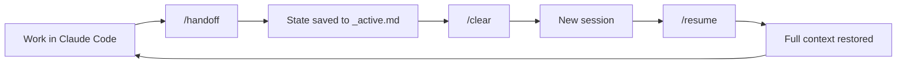
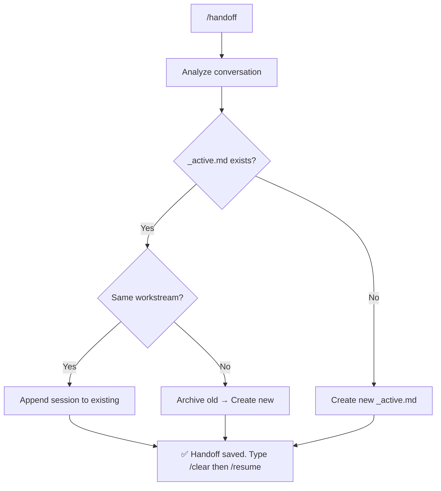
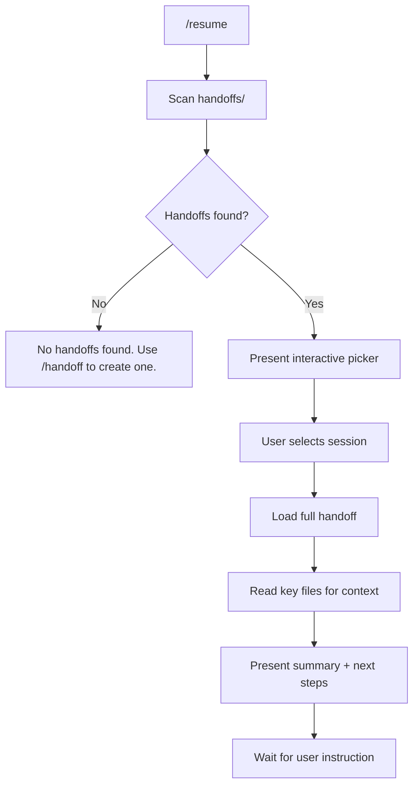
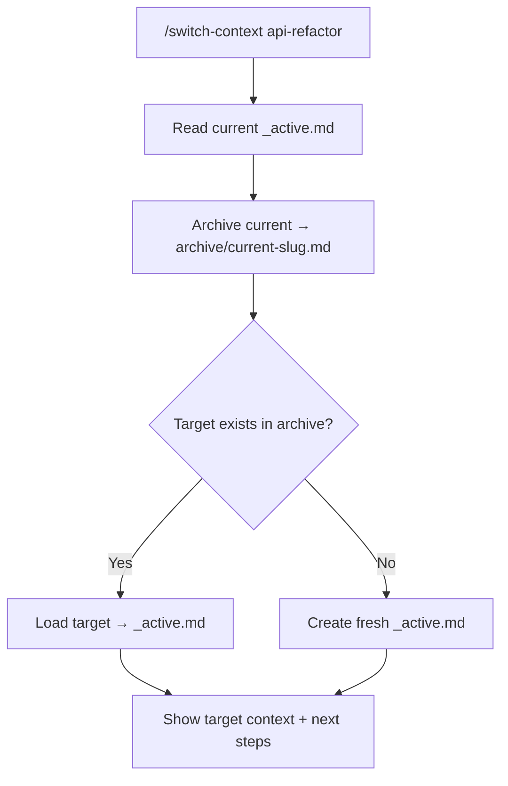
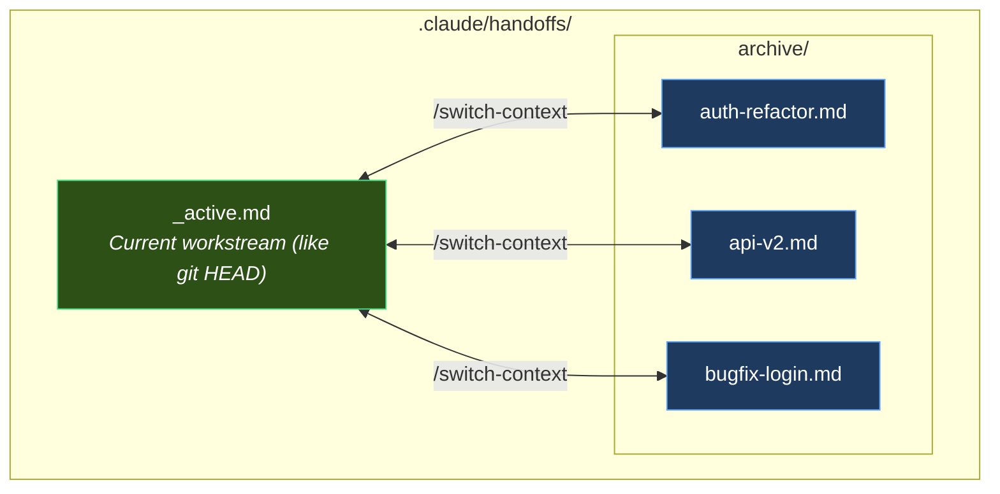
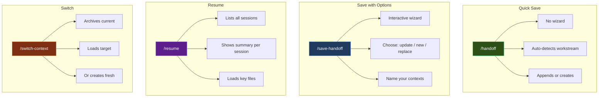

# claude-code-handoff

> Session continuity for [Claude Code](https://docs.anthropic.com/en/docs/claude-code).
> Pick up exactly where you left off — across `/clear`, crashes, or context switches.

[](https://www.npmjs.com/package/claude-code-handoff)
[](./LICENSE)

---

## The Problem

Claude Code operates within a **200K token context window**. As you work, every message, tool call, file read, and response consumes tokens. Eventually, the context fills up — and that's where things break.

### With auto-compact ON (default)

When context usage approaches the limit, Claude Code triggers **auto-compact**: it summarizes the entire conversation into a compressed buffer of approximately **33K tokens**. In theory, this lets you keep working without interruption. In practice, the summarization is **lossy** — Claude loses critical details:

- Exact file paths and line numbers discussed earlier
- Decision rationale ("why did we choose approach A over B?")
- Specific code patterns and variable names
- Nuanced context about edge cases and constraints
- What was already tried and failed

The result: Claude starts repeating mistakes, asking questions you already answered, and proposing solutions that were already rejected. Development quality degrades progressively with each compaction cycle.

### With auto-compact OFF

If you disable auto-compact to preserve full-fidelity context, you hit a hard wall: when the 200K window fills up, you **must** `/clear`. Total context loss. You start from absolute zero — re-explaining the project, the architecture, what was done, what's next.

### The real cost

Either way, you lose. Auto-compact gives you a degraded Claude that forgets. Manual clear gives you an amnesiac Claude that knows nothing. Both waste tokens, time, and developer patience.

**This is the problem claude-code-handoff solves.**

## The Solution

Instead of relying on lossy compression or starting from zero, **claude-code-handoff** gives Claude **structured persistent memory** — 5 slash commands that capture exactly what matters and restore it cleanly:

| Command | Description |
|---------|-------------|
| `/handoff` | Auto-save session state — no questions asked |
| `/resume` | Resume from a saved session — interactive picker |
| `/save-handoff` | Save with options — choose where and how |
| `/switch-context <topic>` | Switch between parallel workstreams |
| `/delete-handoff` | Delete one or more saved handoffs |

The workflow becomes: work until context is full → `/handoff` → `/clear` → `/resume` → continue with full context. No degradation, no amnesia. Just clean handoffs.

Session state is stored in `.claude/handoffs/` (gitignored) — each developer keeps their own context, no conflicts.

---

## Quick Start

```bash
cd your-project
npx claude-code-handoff
```

That's it. Open Claude Code and your 5 commands are ready.

---

## How It Works

### Core Flow



### The `/handoff` Command (Auto-Save)

No wizard, no questions. Claude analyzes the conversation and saves everything automatically.



### The `/resume` Command

Interactive wizard that shows all available sessions and lets you pick one.



### The `/switch-context` Command

Manage parallel workstreams without losing state.



### File Architecture



---

## Install

### Option A: npx (recommended)

```bash
cd your-project
npx claude-code-handoff@1.3.0
```

### Option B: curl

```bash
cd your-project
curl -fsSL https://raw.githubusercontent.com/eximIA-Ventures/claude-code-handoff/main/install.sh | bash
```

### Option C: clone & run

```bash
git clone https://github.com/eximIA-Ventures/claude-code-handoff.git /tmp/claude-code-handoff
cd your-project
/tmp/claude-code-handoff/install.sh
```

### What Gets Installed

```
your-project/
└── .claude/
    ├── commands/
    │   ├── handoff.md            ← /handoff (auto-save)
    │   ├── resume.md             ← /resume (interactive picker)
    │   ├── save-handoff.md       ← /save-handoff (wizard)
    │   ├── switch-context.md     ← /switch-context (workstream switch)
    │   └── delete-handoff.md     ← /delete-handoff (remove handoffs)
    ├── rules/
    │   └── session-continuity.md ← Auto-loaded behavioral rules
    └── handoffs/                 ← Session state (gitignored)
        ├── _active.md            ← Current workstream
        └── archive/              ← Paused workstreams
```

The installer also:
- Creates the full `.claude/handoffs/archive/` directory structure
- Adds `.claude/handoffs/` to `.gitignore`
- Adds a `Session Continuity` section to `.claude/CLAUDE.md` (creates one if missing)

---

## Usage Examples

### Daily workflow

```
you:    [work on feature for a while]
you:    /handoff
claude: Handoff saved. 5 actions recorded, 3 next steps.
        You can now type /clear to free context.
you:    /clear

        ── new session ──

you:    /resume
claude: ## Resuming session
        **Workstream:** auth-refactor
        **Last updated:** 2026-02-16
        ### Last session summary
        - Implemented JWT middleware in src/auth/middleware.ts
        - Added refresh token rotation logic
        - Fixed CORS headers for token endpoint
        ### Next steps
        1. Add unit tests for token rotation
        2. Update API docs for new auth endpoints
        3. Test with frontend login flow
        What would you like to do?
```

### Switching between features

```
you:    /switch-context payments-v2
claude: ## Context switched
        **From:** auth-refactor → archived
        **To:** payments-v2
        ### State
        - Last worked on Stripe webhook handler
        - Next: add idempotency keys
        What would you like to do?
```

### Saving with options

```
you:    /save-handoff
claude: Where should this session's handoff be saved?
        1. Update active (auth-refactor)
        2. Save as new context
        3. Replace active
```

---

## What Gets Captured

The handoff file records everything Claude needs to resume cold:

| Section | Purpose |
|---------|---------|
| **Active Workstream** | What you're working on (name + description) |
| **Active Agent(s)** | Any personas active (e.g., @dev, @architect) |
| **What Was Done** | Session-by-session log with dates |
| **What's Next** | Prioritized, actionable pending items |
| **Key Files** | Files to read for context reload |
| **Current Document** | The main file being worked on |
| **Decisions Registry** | Architectural/design decisions with rationale |

### Session History

Each `/handoff` or `/save-handoff` appends a new session entry. History is preserved — you can see the full timeline of work across sessions:

```markdown
## What Was Done

### Session 3 (2026-02-16)
- Added rate limiting to API endpoints
- Fixed memory leak in WebSocket handler

### Session 2 (2026-02-15)
- Implemented JWT refresh token rotation
- Added CORS configuration

### Session 1 (2026-02-14)
- Set up Express server with TypeScript
- Created initial route structure
```

---

## Architecture

### Design Principles

1. **`_active.md` is like `HEAD` in git** — it always points to your current workstream. No need to remember filenames.
2. **Archive is like branches** — paused workstreams live in `archive/`, ready to be loaded anytime.
3. **Append-only history** — sessions are never deleted, only appended. You can always trace what happened.
4. **Gitignored by default** — each developer has their own session state, no merge conflicts.
5. **Zero dependencies** — the installer is pure bash/Node.js, the commands are plain markdown.

### Command Comparison



| | `/handoff` | `/save-handoff` | `/resume` | `/switch-context` |
|---|---|---|---|---|
| **When** | Before `/clear` | When you need options | Start of session | Mid-session |
| **Interactive** | No | Yes (wizard) | Yes (picker) | No (with arg) |
| **Creates files** | Auto | User chooses | No | Auto |
| **Reads files** | `_active.md` | `_active.md` + `archive/` | All handoffs | `_active.md` + target |

---

## Behavioral Rules

The installer adds a `session-continuity.md` rules file that Claude auto-loads on every session. This gives Claude awareness of the handoff system without you needing to explain it:

- **On session start**: Claude knows `_active.md` exists but doesn't read it unless asked
- **During work**: Claude proactively reminds you to save after significant milestones
- **Command awareness**: Claude understands all 5 commands natively

---

## Update

Update commands and rules to the latest version without touching your handoff data:

```bash
cd your-project
npx claude-code-handoff@latest
```

Or via curl:

```bash
cd your-project
curl -fsSL https://raw.githubusercontent.com/eximIA-Ventures/claude-code-handoff/main/update.sh | bash
```

This will:
- Overwrite command files with the latest versions
- Update the rules file
- Remove legacy Portuguese commands if present (`retomar`, `salvar-handoff`, `trocar-contexto`)
- **Not touch** your `.claude/handoffs/` data

---

## Uninstall

```bash
cd your-project
curl -fsSL https://raw.githubusercontent.com/eximIA-Ventures/claude-code-handoff/main/uninstall.sh | bash
```

The uninstaller:
- Removes all 5 command files
- Removes the rules file
- Preserves handoff data if sessions exist (won't delete your session history)
- Cleans `.gitignore` entries
- Leaves `CLAUDE.md` unchanged (remove the section manually if desired)

Or remove manually:
```bash
rm .claude/commands/{handoff,resume,save-handoff,switch-context,delete-handoff}.md
rm .claude/rules/session-continuity.md
rm -rf .claude/handoffs/  # ⚠️ deletes all session history
```

---

## Requirements

- [Claude Code](https://docs.anthropic.com/en/docs/claude-code) CLI
- Any project directory (with or without existing `.claude/` folder)
- Node.js 18+ (for npx install) or curl (for bash install)

---

## FAQ

**Q: Does this work with multiple developers on the same project?**
A: Yes. Handoff files are gitignored, so each developer has their own session state. No conflicts.

**Q: What happens if I forget to `/handoff` before `/clear`?**
A: The context is lost for that session. The previous handoff is still there — you just won't have the latest session recorded.

**Q: Can I have unlimited workstreams?**
A: Yes. The `archive/` folder has no limit. Each workstream is a single `.md` file.

**Q: Does it work with Claude Code agents/personas?**
A: Yes. The handoff captures which agents are active (e.g., @dev, @architect) so Claude knows the context when resuming.

**Q: What if `_active.md` gets too long?**
A: The commands automatically summarize older sessions into a "Prior Sessions Summary" when the file exceeds ~300 lines.

**Q: Can I edit the handoff files manually?**
A: Absolutely. They're plain markdown. You can add notes, reorder next steps, or clean up history.

---

## Contributing

1. Fork this repo
2. Make your changes
3. Test by running `./install.sh` in a test project
4. Open a PR

---

## License

[MIT](./LICENSE) — built by [exímIA Ventures](https://github.com/eximIA-Ventures)
