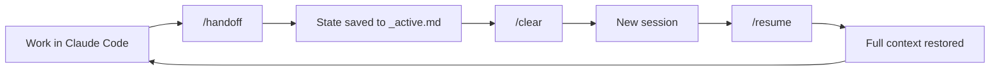
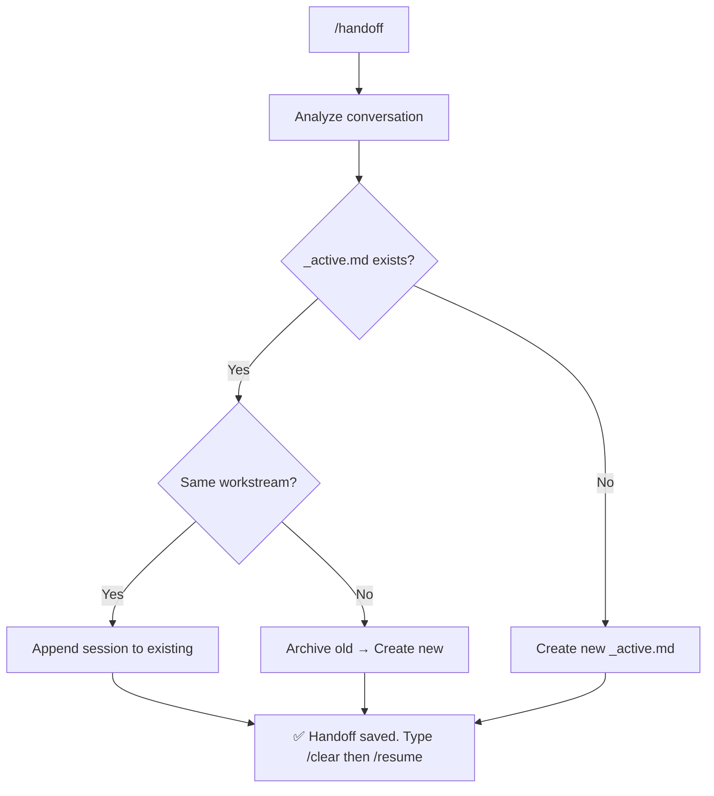
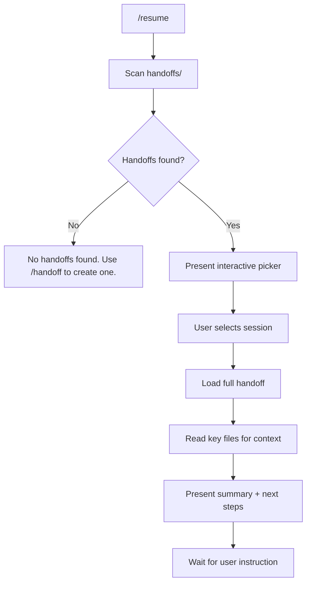
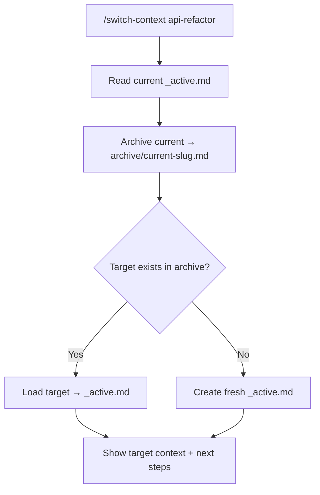
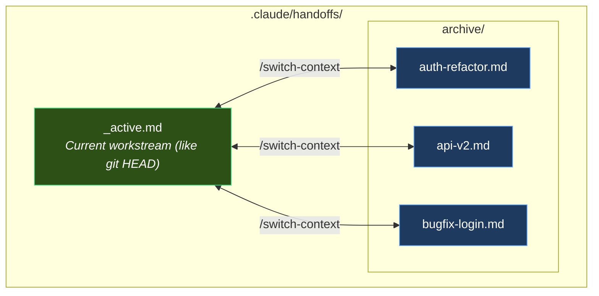
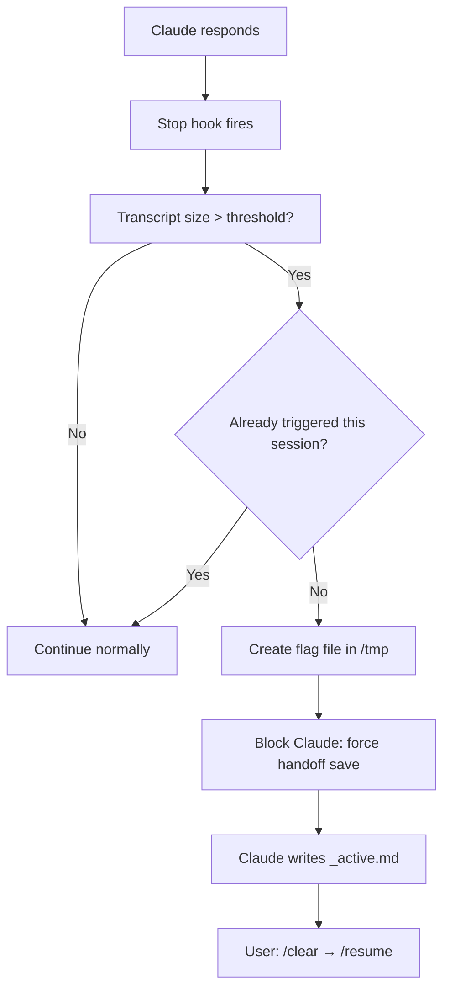
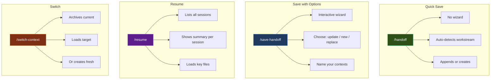

# claude-code-handoff

> Session continuity for [Claude Code](https://docs.anthropic.com/en/docs/claude-code).
> Pick up exactly where you left off — across `/clear`, crashes, or context switches.

[](https://www.npmjs.com/package/claude-code-handoff)
[](./LICENSE)

---

## The Problem

Claude Code operates within a **200K token context window**. As you work, every message, tool call, file read, and response consumes tokens. Eventually, the context fills up — and that's where things break.

### With auto-compact ON (default)

When context usage approaches the limit, Claude Code triggers **auto-compact**: it summarizes the entire conversation into a compressed buffer of approximately **33K tokens**. In theory, this lets you keep working without interruption. In practice, the summarization is **lossy** — Claude loses critical details:

- Exact file paths and line numbers discussed earlier
- Decision rationale ("why did we choose approach A over B?")
- Specific code patterns and variable names
- Nuanced context about edge cases and constraints
- What was already tried and failed

The result: Claude starts repeating mistakes, asking questions you already answered, and proposing solutions that were already rejected. Development quality degrades progressively with each compaction cycle.

### With auto-compact OFF

If you disable auto-compact to preserve full-fidelity context, you hit a hard wall: when the 200K window fills up, you **must** `/clear`. Total context loss. You start from absolute zero — re-explaining the project, the architecture, what was done, what's next.

### The real cost

Either way, you lose. Auto-compact gives you a degraded Claude that forgets. Manual clear gives you an amnesiac Claude that knows nothing. Both waste tokens, time, and developer patience.

**This is the problem claude-code-handoff solves.**

## The Solution

Instead of relying on lossy compression or starting from zero, **claude-code-handoff** gives Claude **structured persistent memory** — 6 slash commands that capture exactly what matters and restore it cleanly:

| Command | Description |
|---------|-------------|
| `/handoff` | Auto-save session state — no questions asked |
| `/resume` | Resume from a saved session — interactive picker |
| `/save-handoff` | Save with options — choose where and how |
| `/switch-context <topic>` | Switch between parallel workstreams |
| `/delete-handoff` | Delete one or more saved handoffs |
| `/auto-handoff` | Enable/disable auto-handoff or adjust threshold |

The workflow becomes: work until context is full → `/handoff` → `/clear` → `/resume` → continue with full context. No degradation, no amnesia. Just clean handoffs.

**Auto-handoff** (since v1.4) monitors your context usage and **automatically triggers a handoff** when the transcript reaches a configurable threshold (default: **90%**) — so you never forget to save. Since v1.5, the threshold is configured as a **percentage of context** instead of fixed bytes, making it intuitive and portable across different setups.

Session state is stored in `.claude/handoffs/` (gitignored) — each developer keeps their own context, no conflicts.

---

## Quick Start

```bash
cd your-project
npx claude-code-handoff
```

That's it. Open Claude Code and your 6 commands are ready. Auto-handoff is enabled by default at 90%.

---

## How It Works

### Core Flow



### The `/handoff` Command (Auto-Save)

No wizard, no questions. Claude analyzes the conversation and saves everything automatically.



### The `/resume` Command

Interactive wizard that shows all available sessions and lets you pick one.



### The `/switch-context` Command

Manage parallel workstreams without losing state.



### File Architecture



---

## Auto-Handoff (Context Monitor)

The biggest risk with handoffs is **forgetting to save**. You're deep in a task, context fills up, and everything is lost. Auto-handoff eliminates this by monitoring your transcript size and **forcing Claude to save the handoff** before it's too late.

### How It Works

A [Claude Code hook](https://docs.anthropic.com/en/docs/claude-code/hooks) runs after every Claude response (Stop event). It reads the **actual token count** from Claude's API usage data in the JSONL transcript and compares it against the 200K token context window. When the threshold is exceeded, it **blocks** Claude's next action and forces an immediate handoff save.



### Threshold Configuration

The threshold is configured as a **percentage of the 200K token context window**. The hook reads the **actual token count** from Claude's API usage data in the transcript — no guesswork, no byte-to-token estimation.

| Preset | Value | Triggers at | Best for |
|--------|-------|-------------|----------|
| **90% (default)** | `THRESHOLD_PERCENT=90` | 180K tokens | Maximizing context usage |
| **80%** | `THRESHOLD_PERCENT=80` | 160K tokens | Balance between space and safety |
| **75%** | `THRESHOLD_PERCENT=75` | 150K tokens | Short sessions, early handoff |

The calculation uses real data:
```
MAX_CONTEXT_TOKENS = 200000   (Claude Code's context window)
THRESHOLD = MAX_CONTEXT_TOKENS × THRESHOLD_PERCENT / 100

# The hook reads input_tokens from the last assistant message in the JSONL
# This is the ACTUAL context size — not an estimate
```

### Three Ways to Configure

**1. Environment variable** (per-session override):
```bash
# Trigger at 80% instead of the default
export CLAUDE_CONTEXT_THRESHOLD=80
```

**2. Interactive wizard** (`/auto-handoff` command):
```
you:    /auto-handoff
claude: Auto-handoff is ENABLED (threshold: 90%). What would you like to do?
        1. Disable
        2. Adjust threshold

you:    [selects "Adjust threshold"]
claude: Which threshold do you want?
        1. 90% (Recommended) — Default, maximizes context usage
        2. 80% — Balance between space and safety
        3. 75% — Short sessions, saves handoff earlier
        4. Other — Type a custom value
```

**3. Edit the script directly**:
```bash
# In .claude/hooks/context-monitor.sh, change the default:
THRESHOLD_PERCENT=${CLAUDE_CONTEXT_THRESHOLD:-90}  # change 90 to your value
```

### Safety Mechanisms

- **One-shot trigger**: A flag file in `/tmp` (per session ID) prevents infinite loops — the hook triggers exactly once per session, even if Claude's handoff response pushes the transcript further
- **Session cleanup**: A `SessionStart` hook automatically cleans up stale flag files older than 24 hours
- **Disable switch**: Create `.claude/hooks/.auto-handoff-disabled` to completely disable the monitor (or use `/auto-handoff` to toggle)
- **Non-destructive**: The hook only blocks and instructs — it never modifies files directly. Claude performs the actual handoff save

### What Happens When It Triggers

When the threshold is hit, Claude receives a block message like:

> ⚠️ AUTO-HANDOFF: Context reached 90% of the limit. You MUST save the handoff NOW.

Claude will then:
1. Analyze the full conversation
2. Write the handoff to `.claude/handoffs/_active.md`
3. Tell you: "Handoff saved automatically. Use `/clear` then `/resume` to continue."

---

## Install

### Option A: npx (recommended)

```bash
cd your-project
npx claude-code-handoff@latest
```

### Option B: curl

```bash
cd your-project
curl -fsSL https://raw.githubusercontent.com/eximIA-Ventures/claude-code-handoff/main/install.sh | bash
```

### Option C: clone & run

```bash
git clone https://github.com/eximIA-Ventures/claude-code-handoff.git /tmp/claude-code-handoff
cd your-project
/tmp/claude-code-handoff/install.sh
```

### What Gets Installed

```
your-project/
└── .claude/
    ├── commands/
    │   ├── handoff.md              ← /handoff (auto-save)
    │   ├── resume.md               ← /resume (interactive picker)
    │   ├── save-handoff.md         ← /save-handoff (wizard)
    │   ├── switch-context.md       ← /switch-context (workstream switch)
    │   ├── delete-handoff.md       ← /delete-handoff (remove handoffs)
    │   └── auto-handoff.md       ← /auto-handoff (on/off + threshold)
    ├── rules/
    │   ├── session-continuity.md   ← Auto-loaded behavioral rules
    │   └── auto-handoff.md         ← Auto-handoff trigger rules
    ├── hooks/
    │   ├── context-monitor.sh      ← Stop hook (monitors context size)
    │   └── session-cleanup.sh      ← SessionStart hook (cleans old flags)
    ├── settings.json               ← Hook configuration
    └── handoffs/                   ← Session state (gitignored)
        ├── _active.md              ← Current workstream
        └── archive/                ← Paused workstreams
```

The installer also:
- Creates the full `.claude/handoffs/archive/` directory structure
- Adds `.claude/handoffs/` to `.gitignore`
- Adds a `Session Continuity` section to `.claude/CLAUDE.md` (creates one if missing)
- Configures auto-handoff hooks in `.claude/settings.json`

---

## Usage Examples

### Daily workflow

```
you:    [work on feature for a while]
you:    /handoff
claude: Handoff saved. 5 actions recorded, 3 next steps.
        You can now type /clear to free context.
you:    /clear

        ── new session ──

you:    /resume
claude: ## Resuming session
        **Workstream:** auth-refactor
        **Last updated:** 2026-02-16
        ### Last session summary
        - Implemented JWT middleware in src/auth/middleware.ts
        - Added refresh token rotation logic
        - Fixed CORS headers for token endpoint
        ### Next steps
        1. Add unit tests for token rotation
        2. Update API docs for new auth endpoints
        3. Test with frontend login flow
        What would you like to do?
```

### Switching between features

```
you:    /switch-context payments-v2
claude: ## Context switched
        **From:** auth-refactor → archived
        **To:** payments-v2
        ### State
        - Last worked on Stripe webhook handler
        - Next: add idempotency keys
        What would you like to do?
```

### Saving with options

```
you:    /save-handoff
claude: Where should this session's handoff be saved?
        1. Update active (auth-refactor)
        2. Save as new context
        3. Replace active
```

### Auto-handoff in action

```
you:    [working normally on a long session...]
claude: [responds to your request]

        ── context reaches 90% ──

claude: ⚠️ AUTO-HANDOFF: Context reached 90% of the limit.
        Handoff saved automatically.
        Use /clear then /resume to continue.

you:    /clear

        ── new session ──

you:    /resume
claude: ## Resuming session
        [full context restored, continues exactly where you left off]
```

### Adjusting auto-handoff threshold

```
you:    /auto-handoff
claude: Auto-handoff is ENABLED (threshold: 90%). What would you like to do?
        1. Disable
        2. Adjust threshold

you:    [selects "Adjust threshold"]
claude: Which threshold do you want?
        1. 90% (Recommended)
        2. 80%
        3. 75%

you:    [types "95" via Other]
claude: ✅ Threshold updated to 95%.
```

---

## What Gets Captured

The handoff file records everything Claude needs to resume cold:

| Section | Purpose |
|---------|---------|
| **Active Workstream** | What you're working on (name + description) |
| **Active Agent(s)** | Any personas active (e.g., @dev, @architect) |
| **What Was Done** | Session-by-session log with dates |
| **What's Next** | Prioritized, actionable pending items |
| **Key Files** | Files to read for context reload |
| **Current Document** | The main file being worked on |
| **Decisions Registry** | Architectural/design decisions with rationale |

### Session History

Each `/handoff` or `/save-handoff` appends a new session entry. History is preserved — you can see the full timeline of work across sessions:

```markdown
## What Was Done

### Session 3 (2026-02-16)
- Added rate limiting to API endpoints
- Fixed memory leak in WebSocket handler

### Session 2 (2026-02-15)
- Implemented JWT refresh token rotation
- Added CORS configuration

### Session 1 (2026-02-14)
- Set up Express server with TypeScript
- Created initial route structure
```

---

## Architecture

### Design Principles

1. **`_active.md` is like `HEAD` in git** — it always points to your current workstream. No need to remember filenames.
2. **Archive is like branches** — paused workstreams live in `archive/`, ready to be loaded anytime.
3. **Append-only history** — sessions are never deleted, only appended. You can always trace what happened.
4. **Gitignored by default** — each developer has their own session state, no merge conflicts.
5. **Zero dependencies** — the installer is pure bash/Node.js, the commands are plain markdown.

### Command Comparison



| | `/handoff` | `/save-handoff` | `/resume` | `/switch-context` | `/auto-handoff` |
|---|---|---|---|---|---|
| **When** | Before `/clear` | When you need options | Start of session | Mid-session | Anytime |
| **Interactive** | No | Yes (wizard) | Yes (picker) | No (with arg) | Yes (wizard) |
| **Creates files** | Auto | User chooses | No | Auto | Toggle file |
| **Reads files** | `_active.md` | `_active.md` + `archive/` | All handoffs | `_active.md` + target | Hook config |

---

## Behavioral Rules

The installer adds a `session-continuity.md` rules file that Claude auto-loads on every session. This gives Claude awareness of the handoff system without you needing to explain it:

- **On session start**: Claude knows `_active.md` exists but doesn't read it unless asked
- **During work**: Claude proactively reminds you to save after significant milestones
- **Command awareness**: Claude understands all 6 commands natively
- **Auto-handoff awareness**: When the context monitor triggers, Claude knows exactly what to do — save the handoff immediately without asking

---

## Update

Update commands and rules to the latest version without touching your handoff data:

```bash
cd your-project
npx claude-code-handoff@latest
```

Or via curl:

```bash
cd your-project
curl -fsSL https://raw.githubusercontent.com/eximIA-Ventures/claude-code-handoff/main/update.sh | bash
```

This will:
- Overwrite command files with the latest versions
- Update rules and hooks to latest
- Ensure hooks are configured in `settings.json`
- Remove legacy files if present (`auto-handoff-toggle.md`, Portuguese commands)
- **Not touch** your `.claude/handoffs/` data or custom threshold settings

---

## Uninstall

```bash
cd your-project
curl -fsSL https://raw.githubusercontent.com/eximIA-Ventures/claude-code-handoff/main/uninstall.sh | bash
```

The uninstaller:
- Removes all 6 command files (including legacy `auto-handoff-toggle.md`)
- Removes rules and hooks
- Cleans hooks from `settings.json` (requires `jq`)
- Preserves handoff data if sessions exist (won't delete your session history)
- Cleans `.gitignore` entries
- Leaves `CLAUDE.md` unchanged (remove the section manually if desired)

Or remove manually:
```bash
rm .claude/commands/{handoff,resume,save-handoff,switch-context,delete-handoff,auto-handoff}.md
rm .claude/rules/{session-continuity,auto-handoff}.md
rm .claude/hooks/{context-monitor,session-cleanup}.sh
rm -rf .claude/handoffs/  # ⚠️ deletes all session history
```

---

## Requirements

- [Claude Code](https://docs.anthropic.com/en/docs/claude-code) CLI
- Any project directory (with or without existing `.claude/` folder)
- Node.js 18+ (for npx install) or curl (for bash install)

---

## FAQ

**Q: Does this work with multiple developers on the same project?**
A: Yes. Handoff files are gitignored, so each developer has their own session state. No conflicts.

**Q: What happens if I forget to `/handoff` before `/clear`?**
A: With auto-handoff enabled (default since v1.4), Claude will automatically save the handoff when the context reaches 90%. Without it, the context is lost for that session — the previous handoff is still there, but you won't have the latest session recorded.

**Q: Can I have unlimited workstreams?**
A: Yes. The `archive/` folder has no limit. Each workstream is a single `.md` file.

**Q: Does it work with Claude Code agents/personas?**
A: Yes. The handoff captures which agents are active (e.g., @dev, @architect) so Claude knows the context when resuming.

**Q: What if `_active.md` gets too long?**
A: The commands automatically summarize older sessions into a "Prior Sessions Summary" when the file exceeds ~300 lines.

**Q: Can I edit the handoff files manually?**
A: Absolutely. They're plain markdown. You can add notes, reorder next steps, or clean up history.

**Q: How does the auto-handoff threshold work?**
A: The threshold is a percentage of Claude Code's 200K token context window. At 90% (default), the hook triggers at 180K tokens. The hook reads the **actual token count** from Claude's API usage data — not file size estimates. You can set any value from 1-100 via env var (`CLAUDE_CONTEXT_THRESHOLD=80`) or the `/auto-handoff` command.

**Q: Can I disable auto-handoff?**
A: Yes. Run `/auto-handoff` and select "Disable", or manually create the file `.claude/hooks/.auto-handoff-disabled`. Delete the file to re-enable.

**Q: What if auto-handoff triggers too early/late?**
A: Adjust the threshold. If it triggers too early, increase to 95%. If you're running out of context before it triggers, lower to 80% or 75%. Use `/auto-handoff` to change it interactively.

---

## Contributing

1. Fork this repo
2. Make your changes
3. Test by running `./install.sh` in a test project
4. Open a PR

---

## License

[MIT](./LICENSE) — built by [exímIA Ventures](https://github.com/eximIA-Ventures)
